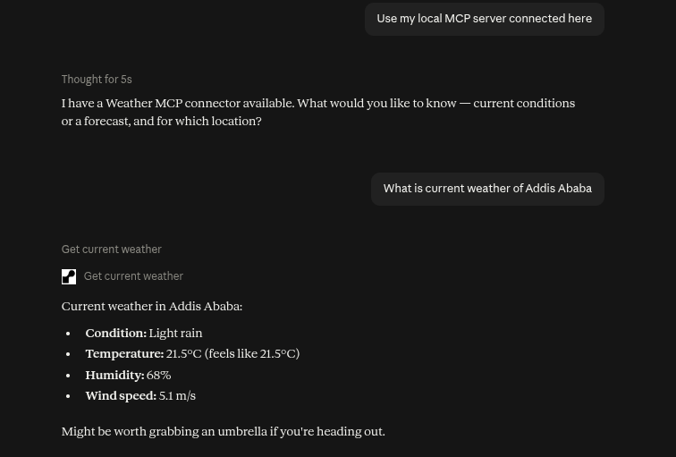

# My Custom MCP Servers

A collection of custom [Model Context Protocol (MCP)](https://modelcontextprotocol.io) servers.

> Currently Deployed on [Render](https://render.com). More servers will be added over time.

## Servers

| Server | Description | Endpoint |
|--------|-------------|----|
| Weather | Current weather & forecasts via OpenWeatherMap | `https://my-custom-mcp-servers.onrender.com/weather/mcp/` |

---

## Weather MCP Server

Exposes weather tools powered by the [OpenWeatherMap API](https://openweathermap.org/api).

### Tools

- `get_current_weather(city)` — Returns current temperature, description, humidity, and wind speed.
- `get_weather_forecast(city)` — Returns a multi-step forecast (every 3 hours).

---

## Testing

### MCP Inspector

1. Run `npx @modelcontextprotocol/inspector`
2. Set transport to `Streamable HTTP`.
3. Enter the server URL: https://my-custom-mcp-servers.onrender.com/weather/mcp/
4. Click **Connect** and invoke tools from the UI.

### Claude Desktop

1. Open Claude Desktop → `Settings` → `Connector` → `Add` -> `Add custom connector`.
2. Write the above URL: https://my-custom-mcp-servers.onrender.com/weather/mcp/
3. Restart Claude Desktop. The weather tools will appear in the tools panel.

---

### Demo
